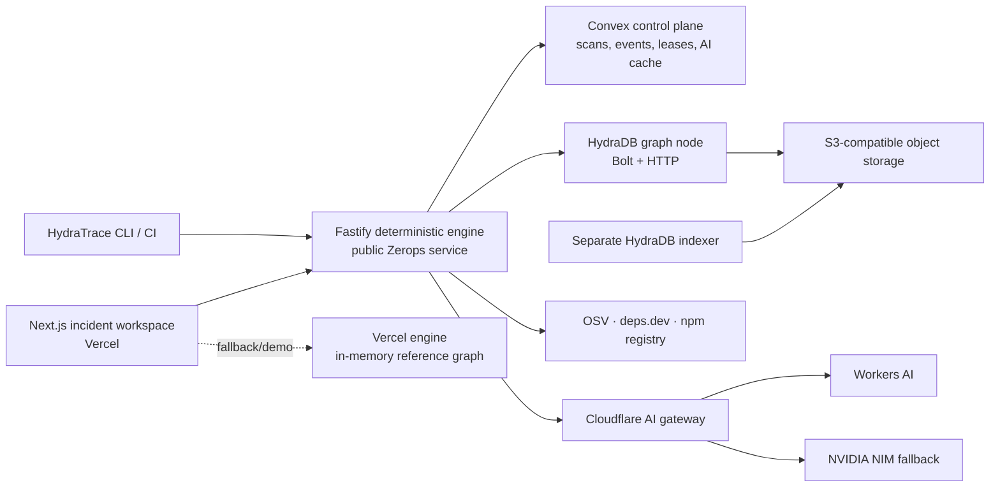

# Architecture

The truth boundary is deterministic. Parsers, advisory/version matching,
deployment/time overlap, reachability state, risk components, paths, set cover,
and remediation verification do not depend on a language model. AI receives a
closed evidence set, may cite only supplied references, and falls back to a
deterministic report when providers fail.

## Data path

1. A lockfile is normalized into a snapshot-independent package/version layer
   plus snapshot-specific resolutions and dependency edges.
2. Content-addressed IDs and provenance make retries idempotent and conflicts visible.
3. Deployment manifests attach immutable snapshots to service/environment/time windows.
4. Exact advisory versions produce incidents; bounded graph paths produce findings.
5. Static and runtime observations attach evidence states without erasing unknowns.
6. Candidate lockfiles are generated without scripts, compared, and covered by an
   exact or greedy solver.
7. A remediation is `PASSED` only when a strong HydraDB query returns zero affected paths.

## Storage and consistency

HydraDB v0.1.1 uses Bolt for bounded scalar writes and causal reads. Its native
`SPpaths` procedure has a 16-hop ceiling. Strong path reads use the official HTTP
query API because the v0.1.1 Bolt strong-path response is incompatible with the
Neo4j JavaScript decoder. Long JSON integers are quoted before parsing to preserve
the full signed 63-bit ID range.

Convex is the durable control plane, not the graph truth source. It stores scan
state/events, jobs/leases, incident records, and evidence-keyed AI results. The
engine can reconstruct scan status across Vercel function instances from Convex.

The production web-on-Vercel design and absence of GitHub Actions are approved
variances from `plan.md`. The Vercel engine is retained only as a stateless
fallback; it does not make a production persistence claim. Engine liveness is
`/health`, while `/ready` verifies HydraDB and the configured separate indexer.
